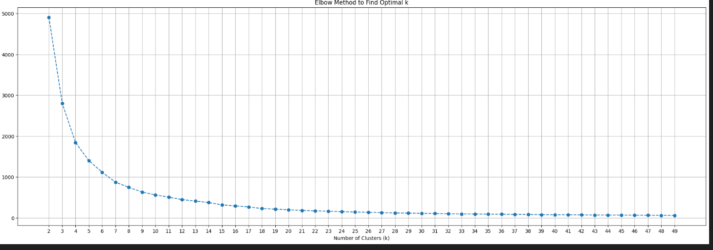

# Analysis And steps
### PreProcssing
1. we need to use contraction, so that sentence become more meaningful
2. Removing numbers, hyperlinks and extra spaces, as these acts as a clutter in our documents
3. we have removed the stop words and lemmatizes the word to make the word more in there natural form

#### Kindly go through `Aditya_NLP_Task_Analysis_and_Modelling.ipynb` for more detail

### No of cluster: 12-14

### We have used 12 cluster to train our mode

## Steps
1. Use Sentence tranformer to generate the mbedding of the documents
2. Reduce the dimension using Umap
3. Using Kmeans find the optimal cluster
4. With optimal cluster train the kmeans
5. Use tf-idf to generate n-gram features(1,2)
6. Convert the generated features into embedding
7. Use umap to reduce the dimension to 64 of generated features
8. Calculate the cosine similarity
9. Get the label through kmeans and top 10 keywords using cosine similarity

## Testing:
1. Generate the embedding of test document using sentence transformers, and dimension reduction using Umap
2. Generate the ngram feature of document using tf-idf
3. Get the embedding of n-grap feature and reduce the dimension using Umap
4. Get the kmeans label of the document after passing through kmeans model
5. Calcualte the similarity and get the top 10 keywords

# Deployment To Rest api using Docker

1. Ensure Docker is installed, if not install these:
pip install --upgrade pip
    * `pip install -U pip setuptools wheel`
    * ` pip install -U spacy`
    * ` pip  install sentence-transformers`
    * ` pip install scikit-learn`
    * ` pip install fastapi`
    * ` pip install umap-learn`
    * ` pip install contractions`
    * ` pip install fastapi==0.99.1  `     
    * ` pip install uvicorn==0.25.0`        
    * ` pip install pandas==2.1.1       `
    * ` pip install numpy==1.26.4       `   
    * ` pip install scipy==1.11.3 `
    * ` pip install pydantic==1.10.13`
    * ` pip install seaborn`
    * ` pip install joblib `
    * ` pip install nltk`
    * ` pip install tqdm ` 
    * ` pip install en_core_web_sm-3.8.0-py3-none-any.whl --no-deps`

2. Navigate To keyword_extractor:

    * if docker is installed
        * In terminal * ` docker build -t car .`
        * `docker *  -p 5005:5005 --name car car`
    * if docker is not installed and you have installed all the dependencies
        * ` uvicorn app:app --host 0.0.0.0 --port 5000 --workers 1`
3. After this model will start on port 5000

4. To test the api, you can navigate to

    * test directory
    * In test.py change the url and text and run `python test.py`

# Testing Result:
results.xlsx contain the keyword and labels

 